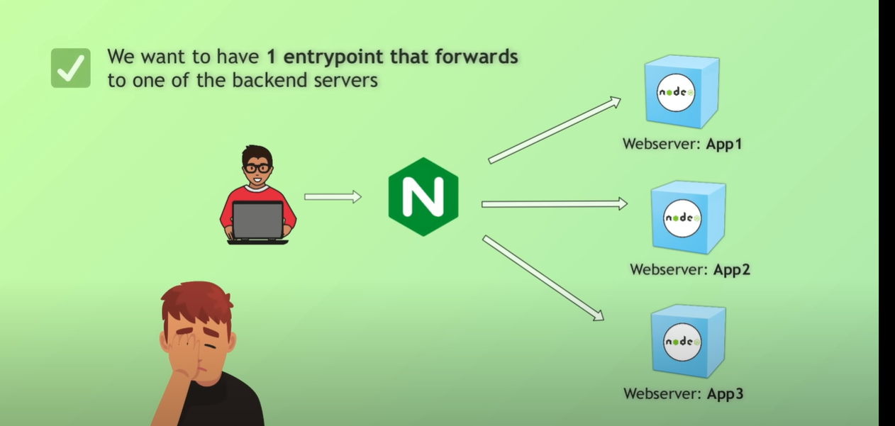

1. scp -i ~/Downloads/vprobeankey.pem -r /c/Nginx_crash_course/ ubuntu@54.242.123.21:/home/ubuntu
--make sure to remove node modules from your local and then copy to ec2 instance and there run npm install

docker build -t myapp:1.0 .

docker run -p 3000:3000 myapp:1.0

docker-compose up --build -d

Notes:

1. created Ngnix folder
wrote server.js,wrote some dependencies in packag.json,docker compose file,docker file,index.html

2. created EC2 instances
there copied all the content from Ngnix folder to ec2 instance with scp command and made sure that opening three different ports in security group.

3. Putting the right folders and files at right places
once we are inside ec2 make sure that have your docker file and docker compose file inside the Ngnix folder and ur index.html file inside public or you can put index.html file directly inside Ngnix folder but make the changes in docker file accordingly!!

4. Run the Docker compose file
As we have created simple docker file where we have mentioned for 1 app and then creted docker compose file and took the help of docker file to create 3 servers or 3 apps!!

5. Install Ngnix:

sudo apt update
sudo apt install -y nginx
sudo systemctl start nginx
sudo systemctl enable nginx
systemctl status nginx

6. Location of Nginx:
whereis nginx
nginx: /usr/sbin/nginx /etc/nginx /usr/share/nginx /usr/share/man/man8/nginx.8.gz

7. For making changes in nginx.conf
sudo vim /etc/nginx/nginx.conf

8. For testing and reloading
sudo nginx -t
sudo systemctl reload nginx

---so basically Ngnix will behave as proxy server on top of our multiple backend server that we created and dockerised it! and Nginx is going interact with the client server so it is kind of proxy!!
client->Nginx->backend server
--- After we dockerized our application we configured Nginx -->file sudo vim /etc/nginx/nginx.conf
--- sudo nginx -t
sudo systemctl reload nginx
--- then took publicip:8000 and check the page is running and here backend is not 
directly interacting with the client instead nginx is interacting with the client

----------------*******************__________________________***********
worker_processes 1;

events{
        worker_connections 1024;

 }

http{

   include mime.types;
   upstream nodejs_cluster{
           least_conn;
           server 54.174.222.1:3001;
           server 54.174.222.1:3002;
           server 54.174.222.1:3003;
   }

    server{
        listen 8080;
        server_name localhost;

        location /{
             proxy_pass http://nodejs_cluster;
             proxy_set_header Host $host;
             proxy_set_header X-Real-IP $remote_addr;
             }

         }

     }

__________________********************__________________________*******************

9. Now we will be doing ss config
--for that first we create a folder
sudo openssl req -x509 -nodes -days 365 -newkey rsa:2048 \
-keyout /etc/ssl/private/nginx-selfsigned.key \
-out /etc/ssl/certs/nginx-selfsigned.crt

10. For adding ssl in group 
Create the ssl-cert group:

sudo groupadd ssl-cert

Change ownership of the key:

sudo chown root:ssl-cert /etc/ssl/private/nginx-selfsigned.key

Set safe permissions:

sudo chmod 640 /etc/ssl/private/nginx-selfsigned.key

Add Nginx user (www-data) to the group:

sudo usermod -aG ssl-cert www-data

Restart Nginx:

sudo systemctl restart nginx

11. code 

http {
    include       mime.types;
    default_type  application/octet-stream;

    upstream nodejs_cluster {
        least_conn;
        server 54.174.222.1:3001;
        server 54.174.222.1:3002;
        server 54.174.222.1:3003;
    }

    server {
        listen 443 ssl;
        server_name _;

        ssl_certificate     /etc/ssl/certs/nginx-selfsigned.crt;
        ssl_certificate_key /etc/ssl/private/nginx-selfsigned.key;

        location / {
            proxy_pass http://nodejs_cluster;
            proxy_set_header Host $host;
            proxy_set_header X-Real-IP $remote_addr;
            proxy_set_header X-Forwarded-For $proxy_add_x_forwarded_for;
            proxy_set_header X-Forwarded-Proto $scheme;
        }
    }

    server {
        listen 8080;
        server_name _;

        location / {
            return 301 https://$host$request_uri;
        }
    }
}

                                               

12. For cleanup
sudo nginx -s stop

