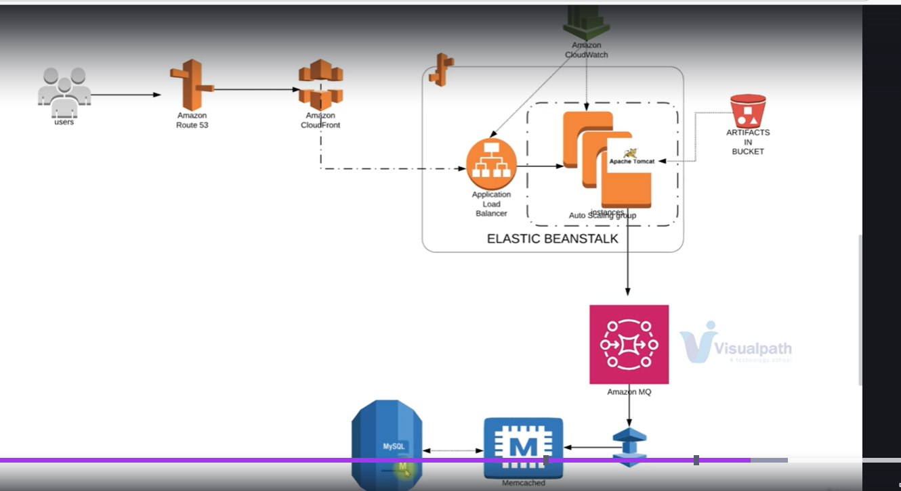
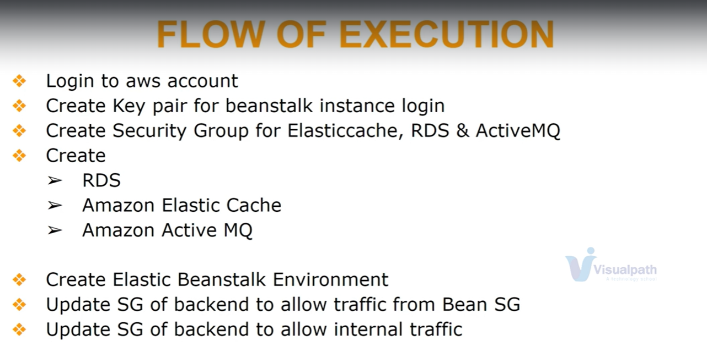
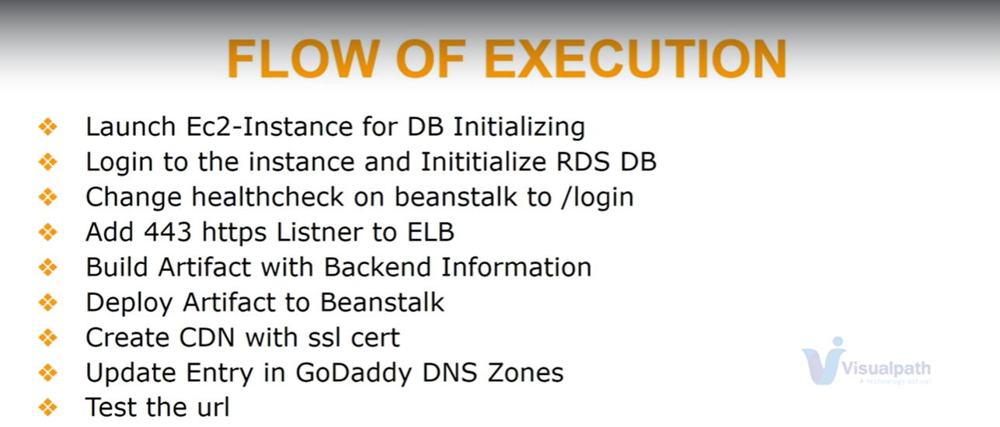

1. Re-Archetecturing web App on AWS Cloud
*************************

*************************
***********************

************************
************************

*************************

1. create securitygroup for the bacend services (Amazon RDS, Rabbit MQ->Amazon MQ, Elastic Cache Node) and allowed the traffic internally inside the security group so that all the backend services can interact with each other.

